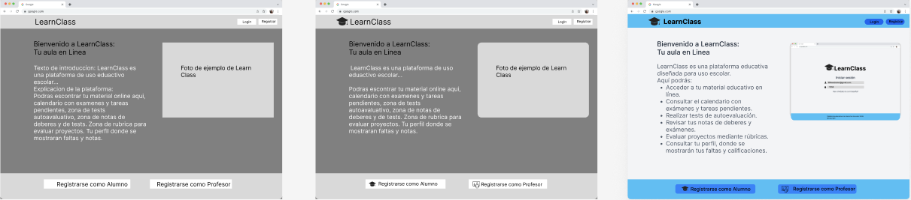
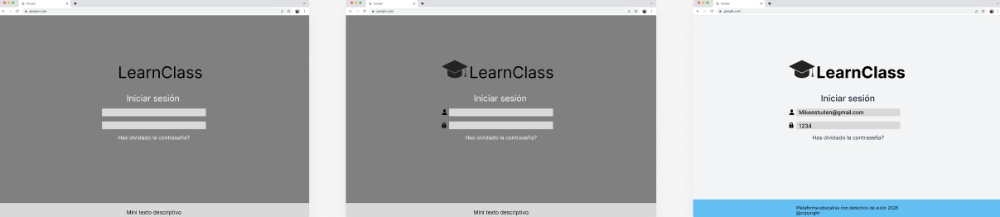
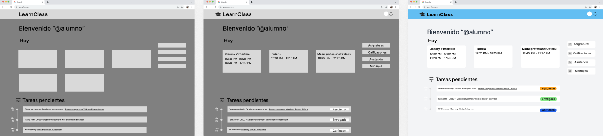
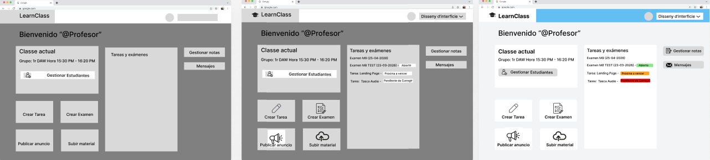
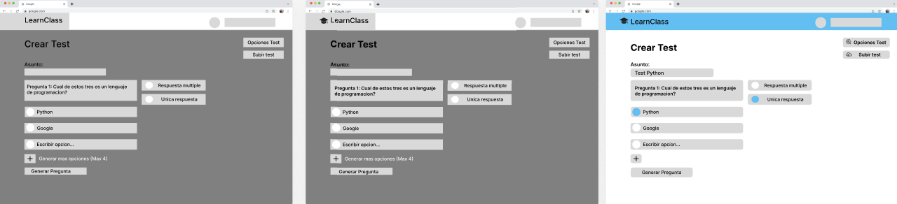

# LearnClass - Plataforma Educativa

Una plataforma web que permite a los profesores gestionar cursos y a los alumnos acceder a materiales, entregar tareas y comunicarse con sus profesores.

---

## 1. Idea del proyecto

LearnClass es una plataforma web diseñada para mejorar la comunicación y organización entre profesores y alumnos.

Muchos estudiantes necesitan acceder a materiales de clase, entregar tareas o comunicarse con el profesor utilizando diferentes herramientas dispersas. LearnClass reúne todas estas funcionalidades en un único entorno digital, seguro y fácil de usar.

La plataforma permite que los profesores creen materias, suban materiales, asignen tareas y publiquen anuncios, mientras que los alumnos pueden acceder al contenido, entregar trabajos, realizar tests evaluativos y consultar sus calificaciones.

El objetivo principal es facilitar la gestión académica y mejorar la comunicación entre profesores y alumnos mediante una plataforma sencilla, segura y profesional.

---

## 2. Funcionalidades implementadas

### Autenticación y usuarios
- Registro con verificación por PIN enviado al email (Nodemailer + Gmail SMTP)
- Inicio de sesión con autenticación JWT (token con caducidad de 24 horas)
- Dos roles diferenciados: **profesor** y **alumno**
- Protección de rutas mediante middleware de autenticación

### Profesor
- Crear y gestionar múltiples materias con código de unión único
- Crear tareas con fecha límite y archivo adjunto
- Crear tests evaluativos manualmente o **generados automáticamente con IA** (Groq API - Llama 3.3)
- Ver entregas de los alumnos y calificar con nota y feedback
- Subir material de clase (PDF, ZIP, DOC, imágenes, etc.)
- Publicar anuncios para los alumnos de una materia
- Gestionar alumnos — ver quién está matriculado y expulsarlos
- Seleccionar entre múltiples materias desde el dashboard

### Alumno
- Unirse a materias mediante código de clase
- Ver tareas pendientes, vencidas y entregadas en un timeline
- Entregar tareas con archivo y comentario antes de la fecha límite
- Realizar tests evaluativos
- Descargar material subido por el profesor
- Recibir anuncios del profesor con notificación en la campana
- Ver calificaciones y feedback de las tareas entregadas

---

## 3. Arquitectura y tecnología

El proyecto sigue una arquitectura **cliente-servidor basada en el patrón MVC (Model-View-Controller)**.

```
models/      → Esquemas de MongoDB (Mongoose)
views/       → Plantillas EJS (HTML dinámico)
controllers/ → Lógica de negocio
routes/      → Definición de rutas Express
middleware/  → Autenticación JWT
config/      → Configuración de servicios externos
```

### Frontend
- **HTML + CSS + JavaScript** — sin frameworks, vanilla puro
- **EJS** — motor de plantillas para renderizar vistas desde el servidor
- **Font Awesome** — iconos
- **Google Fonts** — tipografía Inter

### Backend
- **Node.js** — entorno de ejecución
- **Express.js** — framework web para gestionar rutas y peticiones HTTP
- **JWT (jsonwebtoken)** — autenticación sin estado (stateless)
- **Bcrypt** — encriptación de contraseñas
- **Multer** — subida de archivos al servidor
- **Nodemailer** — envío de emails con Gmail SMTP

### Base de datos
- **MongoDB Atlas** — base de datos NoSQL en la nube
- **Mongoose** — ODM para definir esquemas y hacer consultas

### API externa de IA
- **Groq API** (modelo Llama 3.3 70B) — generación automática de preguntas para tests evaluativos

---

## 4. Modelos de datos

| Modelo | Descripción |
|--------|-------------|
| `Usuario` | Profesores y alumnos con rol, email, contraseña encriptada y estado de verificación |
| `Materia` | Asignatura con código único, profesor propietario y array de alumnos matriculados |
| `Tarea` | Actividad con fecha límite, archivo adjunto y array de entregas de alumnos |
| `Test` | Examen con preguntas, opciones y respuesta correcta |
| `Material` | Archivo subido por el profesor asociado a una materia |
| `Anuncio` | Mensaje del profesor con control de lectura por alumno |

---

## 5. Flujo de autenticación

```
1. Registro → el usuario rellena el formulario y elige rol
        ↓
2. El servidor guarda el usuario con verificado: false
   y envía un PIN de 6 dígitos al email
        ↓
3. El usuario introduce el PIN en la página de verificación
        ↓
4. El servidor verifica el PIN, marca al usuario como verificado
   y genera un token JWT con sus datos (id, rol, email)
        ↓
5. El frontend guarda el token en localStorage
   y redirige al dashboard según el rol
        ↓
6. En cada petición el frontend manda el token en el header:
   Authorization: Bearer <token>
        ↓
7. El middleware auth.js verifica el token
   y permite o deniega el acceso a la ruta
```

---

## 6. Integración con IA (Groq API)

El profesor puede generar preguntas automáticamente para los tests usando IA:

1. El profesor escribe el **tema** y el **número de preguntas**
2. El frontend manda la petición al backend (`/ia/generar-preguntas`)
3. El backend llama a la **API de Groq** con el modelo `llama-3.3-70b-versatile`
4. La IA devuelve las preguntas en formato JSON
5. Las preguntas aparecen en el formulario listas para editar y publicar

> La llamada se hace desde el **backend** para proteger la API key — nunca se expone al navegador.

---

## 7. Variables de entorno (.env)

```
PORT=3000
MONGO_URI=mongodb+srv://...
SESSION_SECRET=clave_secreta_jwt
GMAIL_USER=tu_email@gmail.com
GMAIL_PASS=contraseña_aplicacion
GROQ_API_KEY=tu_api_key_groq
```

---
## 8. Mockups figma






`

## 9. Estructura de carpetas

```
Proyecto Learn Class/
├── config/          → Configuración de servicios (Cloudinary, etc.)
├── controllers/     → Lógica de negocio (authController, materiaController)
├── middleware/      → Autenticación JWT (auth.js)
├── models/          → Esquemas Mongoose (Usuario, Materia, Tarea, Test, Material, Anuncio)
├── routes/          → Rutas Express (auth, materias, tests, anuncios, ia)
├── views/           → Plantillas EJS (todas las páginas)
├── Public/          → Archivos CSS estáticos
├── uploads/         → Archivos subidos por los usuarios
├── .env             → Variables de entorno (no subir a GitHub)
├── app.js           → Punto de entrada de la aplicación
└── package.json     → Dependencias del proyecto
```

---
## 10. Posibles mejoras
### Funcionalidades pendientes

**Tests evaluativos completos** — actualmente el profesor puede crear tests pero falta la página donde el alumno los responde y el sistema los autocorrige automáticamente mostrando la nota final
**Calificaciones globales** — una sección donde el alumno pueda ver todas sus notas de todas las materias en un único panel, con la media calculada automáticamente
**Sistema de mensajería en tiempo real** — chat entre profesor y alumno usando Socket.io, que ya está preparado en la estructura del proyecto pero sin implementar

### Mejoras técnicas

Separar controladores de rutas — actualmente algunas rutas como anuncios.js y tests.js tienen la lógica mezclada dentro del router en vez de en un controlador separado, lo que va en contra del patrón MVC
Subida de archivos a la nube — migrar de almacenamiento local (uploads/) a Cloudinary para que los archivos persistan correctamente en producción (en Render el sistema de archivos local se reinicia con cada despliegue)
Caché del servidor — añadir cabeceras Cache-Control para evitar que el navegador muestre el dashboard tras cerrar sesión

Mejoras de experiencia de usuario

Perfil de usuario — página donde el alumno y el profesor puedan editar su nombre, foto de perfil e institución
Estadísticas para el profesor — gráficas con el porcentaje de entregas por tarea, notas medias y participación de los alumnos
Notificaciones por email — avisar al alumno por email cuando el profesor publica una tarea nueva o califica una entrega
Modo oscuro — opción para cambiar entre tema claro y oscuro

---


## 11. URL
https://learnclass.onrender.com
